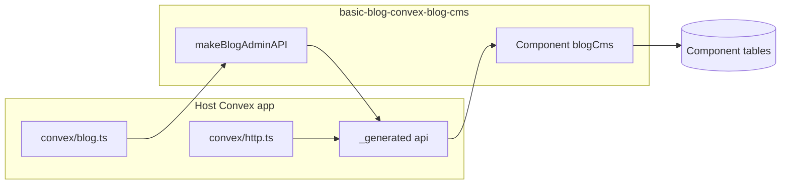

# Setup: install the Convex blog CMS component

This guide is for **integrators** adding `basic-blog-convex-blog-cms` to an existing Convex + (optionally) Next.js app. It mirrors [Convex component authoring](https://docs.convex.dev/components/authoring) expectations: install the package, register the component, re-export the host API, and mount HTTP.

## Prerequisites

- Node 18+
- A Convex project (`npx convex dev` configured)
- `convex` peer dependency (see package README)

## 1. Install

```bash
npm install basic-blog-convex-blog-cms convex
# or
pnpm add basic-blog-convex-blog-cms convex
```

## 2. Register the component

In your app’s `convex/convex.config.ts`:

```ts
import { defineApp } from "convex/server";
import blogCms from "basic-blog-convex-blog-cms/convex.config.js";

const app = defineApp();
app.use(blogCms);
export default app;
```

## 3. Expose the host API

Create `convex/blog.ts` (or split files) and wire **`makeBlogAdminAPI`**:

```ts
import { makeBlogAdminAPI } from "basic-blog-convex-blog-cms";
import { components } from "./_generated/api.js";

export const {
  getPublishedPostBySlug,
  listPublishedPosts,
  getPublicSiteSettings,
  getPostForAdmin,
  listPostsForAdmin,
  createPost,
  updatePost,
  publishPost,
  unpublishPost,
  deletePost,
  replacePostBlocks,
  upsertSiteSettings,
} = makeBlogAdminAPI(components.blogCms, {
  auth: async (ctx, operation) => {
    // Enforce auth for adminRead / adminWrite only
    if (operation.type === "adminRead" || operation.type === "adminWrite") {
      // e.g. require Convex Auth identity
      // const id = await ctx.auth.getUserIdentity();
      // if (!id) throw new Error("Unauthorized");
    }
  },
});
```

Run `npx convex dev` so `_generated` includes `components.blogCms`.

### 3b. Image uploads (bundled admin)

The bundled admin uploads images via **`blog.generateUploadUrl`**, which is included when you spread **`makeBlogAdminAPI`** into `convex/blog.ts` (export `generateUploadUrl` alongside the other functions). It uses the **same admin auth** as saving posts (`adminApiKey` and/or your `auth` callback). No separate `convex/media.ts` or `DEMO_ADMIN_MODE` is required.

See [examples/convex-host/convex/blog.ts](../examples/convex-host/convex/blog.ts) for a full export list.

## 4. Mount RSS / sitemap (optional)

Copy the pattern from [`docs/reference/convex-host/convex/http.ts`](../reference/convex-host/convex/http.ts): `httpActionGeneric` handlers that call your public queries and use helpers from `basic-blog-convex-blog-cms/next` (`buildRssXml`, `buildSitemapXml`, etc.).

## 5. Next.js client (optional)

- Set `NEXT_PUBLIC_CONVEX_URL` to your deployment URL.
- Wrap the app with `ConvexProvider` from `convex/react`.
- Import SEO helpers and DTO types from `basic-blog-convex-blog-cms/next`. Render posts with your own components, or copy the reference UI from [`examples/blog-ui`](../examples/blog-ui) in this repo ([RENDERING.md](./RENDERING.md)).

## 6. Minimal public blog (Next.js App Router)

Assume your host already exports `api.blog.*` from step 3. Add routes that **only** use public queries (`getPublishedPostBySlug`, `listPublishedPosts`, `getPublicSiteSettings`).

### `app/blog/page.tsx` (post list)

Server Component using `fetchQuery` from `convex/nextjs` (requires `NEXT_PUBLIC_CONVEX_URL`):

```tsx
import { fetchQuery } from "convex/nextjs";
import { api } from "@/convex/_generated/api";
export default async function BlogIndexPage() {
  const posts = await fetchQuery(api.blog.listPublishedPosts, { limit: 50 });
  return (
    <main className="mx-auto max-w-2xl p-6">
      <h1 className="mb-6 text-2xl font-semibold">Blog</h1>
      <ul className="space-y-2">
        {posts.map((p) => (
          <li key={p.slug}>
            <a className="text-blue-600 underline" href={`/blog/${p.slug}`}>
              {p.title}
            </a>
          </li>
        ))}
      </ul>
    </main>
  );
}
```

For a client-only list, swap `fetchQuery` for `useQuery` from `convex/react` and add `"use client"`.

### `app/blog/[slug]/page.tsx` (single post + metadata)

Same route can export `generateMetadata` and a default server page. `postToNextMetadata` lives in `basic-blog-convex-blog-cms/next`.

```tsx
import type { Metadata } from "next";
import { notFound } from "next/navigation";
import { fetchQuery } from "convex/nextjs";
import { api } from "@/convex/_generated/api";
import { postToNextMetadata } from "basic-blog-convex-blog-cms/next";

type Props = { params: Promise<{ slug: string }> };

export async function generateMetadata({ params }: Props): Promise<Metadata> {
  const { slug } = await params;
  const decoded = decodeURIComponent(slug);
  const data = await fetchQuery(api.blog.getPublishedPostBySlug, {
    slug: decoded,
  });
  if (!data) {
    return { title: "Not found" };
  }
  const site = await fetchQuery(api.blog.getPublicSiteSettings, {});
  return postToNextMetadata({
    post: data.post,
    blocks: data.blocks,
    site,
    path: `/blog/${decoded}`,
  });
}

export default async function BlogPostPage({ params }: Props) {
  const { slug } = await params;
  const decoded = decodeURIComponent(slug);
  const data = await fetchQuery(api.blog.getPublishedPostBySlug, {
    slug: decoded,
  });
  if (!data) {
    notFound();
  }
  return (
    <main className="mx-auto max-w-3xl p-6">
      <article>
        <h1 className="text-3xl font-bold">{data.post.title}</h1>
        {/* Map `data.blocks` in `order` and switch on `block.type` — see [RENDERING.md](./RENDERING.md) */}
      </article>
    </main>
  );
}
```

On **Next.js 14**, `params` is a plain object (not a `Promise`); omit `await` on `params` and type `Props` as `{ params: { slug: string } }`.

Rendering: see [RENDERING.md](./RENDERING.md).

## 7. Build order (library developers)

When changing the **component** source under `src/component`, follow Convex’s recommended order:

1. `npx convex codegen --component-dir ./path/to/component`
2. `npm run build` (or `tsc`) for the package
3. `npx convex dev` in the consuming app

See [CONTRIBUTING.md](../CONTRIBUTING.md) in this repo.

## Architecture



## See also

- [CONFIGURATION.md](./CONFIGURATION.md) — all env vars and knobs
- [RENDERING.md](./RENDERING.md) — DTOs and optional example UI
- [packages/convex-blog-cms/README.md](../packages/convex-blog-cms/README.md) — npm exports and peers
